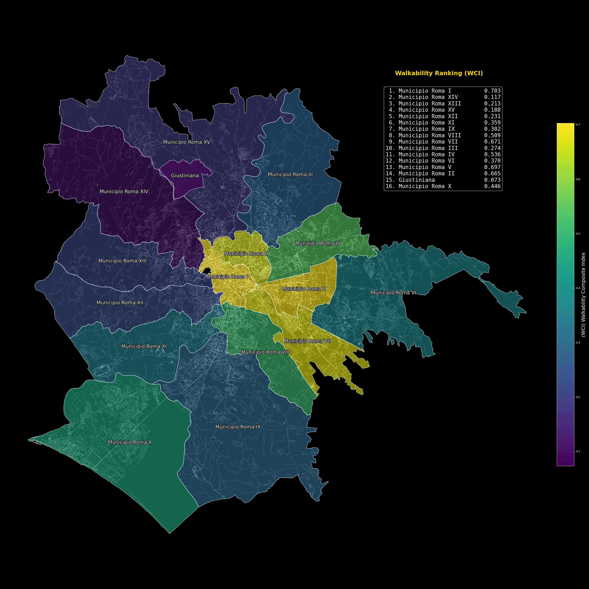

# 🏙️ WCI – Walkability Composite Index  

Urban walkability can be understood and measured in many different ways, which makes the concept inherently multifaceted. A walkable environment might be defined by a dense and connected street network, or by the availability of diverse services within a short walking distance.

However, other factors — such as the **morphological characteristics** of the urban landscape — can also significantly influence both **walkability**, especially in topographically complex cities like Rome.

This project aims to evaluate the **walkability of the city of Rome** by analyzing a set of spatial metrics derived from **OpenStreetMap (OSM)** data and **satellite elevation data** from the **Copernicus Digital Elevation Model (COP-DEM)**. These metrics are then combined into a **composite accessibility index (WCI)** to identify which municipalities of Rome are more — or less — accessible by foot. 
> 

---
## Repository Structure
- **Walkability-Rome/**
  - **data/**  
    - **slope_d/**  
    - **connectivity_d/**  
    - **15min_d/**  
  - **notebooks/**  
    - `connectivity.ipynb`  
    - `15min_score.ipynb`  
    - `slope.ipynb`  
  - **outputs/**  
  - `README.md`  
  - `requirements.txt`  
---

## Installation Notes
This project was developed with **Python 3.11** and includes both vector and raster spatial analysis tools. To ensure full reproducibility and compatibility, follow the instructions below.\

### ⚙️ GDAL Installation
GDAL has to be installed on your system.
GDAL is required for raster processing and command-line tools like `gdalwarp` and `gdaldem` used in this project.

### On Ubuntu/Debian:
sudo apt-get update\
sudo apt-get install gdal-bin libgdal-dev

### On macOS(Homebrew):
brew install gdal

### On Windows(conda):
conda install -c conda-forge gdal

### Python Environment Setup
Once GDAL is installed:

python -m venv venv\
source venv/bin/activate       # or venv\Scripts\activate on Windows\
pip install -r requirements.txt

---

## 📌 Project Structure
The project is organized into separate notebooks, each addressing a different component of walkability through a specific methodological approach. Every notebook focuses on a distinct spatial dimension — connectivity, accessibility, and morphology — and concludes with a visualization of Rome’s municipalities based on that particular criterion.

The final notebook, focused on slope and urban morphology, also includes the construction of the composite Walkability Index, which combines the previous metrics into a single indicator.

### 1. Connectivity (`connectivity.ipynb`)
- Download and preprocess **OSM street network** using osmnx  
- Project and clip the network to the administrative boundaries of Rome’s **municipalities**  
- Perform cleaning of neighborhoods to ensure smoother analysis  
- Initially replicate the first part of the walkability analysis from [this project](https://github.com/eemilhaa/walkability-analysis) to provide an overview of connectivity across the entire city  
- Compute **node density** (nodes/km²) as a measure of network connectivity  
- Visualize node distribution and density per municipality  

---

### 2. Accessibility (`15min_score.ipynb`)
- Reproduced the **15-minute City score** methodology as referenced in the literature, which evaluates access to essential amenities within a 15-minute walk.  
- Adapted the approach to suit the local context of Rome and the available data.  
- To ensure a robust classification of municipalities, calculated the **coverage ratio**, the fraction of hexagons with valid cityscore data.  
- Computed the **mean cityscore** only over hexagons with data, then defined a **weighted cityscore** as:  

  `mean_cityscore_weighted = mean_cityscore × coverage_ratio`  

- This weighting accounts for municipalities with incomplete data by proportionally reducing their scores, reflecting actual lower accessibility due to limited pedestrian connectivity or amenity reachability.  
- Calculated an **aggregated score per municipality** based on this weighted cityscore.  
- Visualized the results for clear interpretation of accessibility patterns across Rome’s municipalities.

---

### 3. Morphology (`slope.ipynb`)
- Provide urban context by relating slope values to the morphology of Rome’s municipalities  
- Download and preprocess **Copernicus DEM** (30m resolution)  
- Reproject DEM to **EPSG:25833** for accurate metric slope computation  
- Compute slope in **degrees** using:  
  - `gdaldem slope` from GDAL  
- Use **zonal statistics** to compute average slope per municipality  
- Visualize slope distribution and its impact on walkability  

---

### 4. Composite Walkability Index (inside `slope.ipynb`)
- Normalize individual components:
  - **Node density**
  - **mean_cityscore_weighted**
  - **Average slope (inversely weighted)**
- Combine metrics into a final **Walkability Composite Index (WCI)**
- Rank and visualize the results across municipalities

---

## 📌 Results
The Walkability Composite Index (WCI) map provides a synthesis of walkability across Rome’s municipalities by combining key metrics such as connectivity, accessibility, and morphology.
> 

The results reflect the actual urban structure of Rome: central and well-connected districts like **Municipio I, V, and VII** score highest, while peripheral or hilly areas such as **Giustiniana** and **Municipio XIV** show lower walkability due to limited infrastructure, sparse services, and challenging morphology.

It is worth noting that some municipalities span both central and peripheral areas. In such cases, the overall score may penalize too much municipalities that include highly walkable neighborhoods alongside more inaccessible zones — a limitation inherent in the use of broad administrative boundaries for aggregation.

---

## 📌 Notes & Limitations
- Elevation and slope calculations rely on the accuracy of **COP-DEM GLO-30** data and may be affected by resolution.
- Walkability is modeled purely from spatial structure and access — no behavioral or socioeconomic factors are included (e.g. age, safety, comfort).
- The three components used (connectivity, 15-minute score, and slope) differ in nature: connectivity is an indicator, the 15-minute score is a service-based accessibility score, and slope is a morphological factor. However, all have been treated as normalized scores to allow their integration into a single composite index. While this approach enables comparison, it simplifies their theoretical differences.

---

## 📌 Important
For any clarification or details about the methods and results, please refer to the corresponding Jupyter notebooks included in this repository.

---

## Data Sources
- **OpenStreetMap** 
- **Copernicus DEM GLO-30** 

---

##  Future Improvements
- Extend the analysis to a **neighborhood-level resolution** or replicate it in other cities
- Integrate a dedicated **bikeability component**, which shares similar spatial determinants and can complement walkability with minimal extra cost
- Incorporate **land use**, **sidewalk quality**, or **real pedestrian travel time**

---

## References

### Literature
- Ewing, R., & Cervero, R. (2010). Travel and the built environment: A meta-analysis. Journal of the American planning association, 76(3), 265-294.
  https://doi.org/10.1080/01944361003766766

- Frank, L. D., Sallis, J. F., Conway, T. L., Chapman, J. E., Saelens, B. E., & Bachman, W. (2006).  
  *Many Pathways from Land Use to Health: Associations between Neighborhood Walkability and Active Transportation, Body Mass Index, and Air Quality*.  
  *Journal of the American Planning Association.*
  https://doi.org/10.1080/01944360608976725

- Witten, K., Pearce, J., & Day, P. (2011).  
  *Neighbourhood destination accessibility index: a GIS tool for measuring infrastructure support for neighbourhood physical activity*.  
  *Environment and Planning A.*
  https://doi.org/10.1068/a43105
  
### Methodological Foundations
- [Walkability Analysis by eemilhaa](https://github.com/eemilhaa/walkability-analysis) – Project used as a direct methodological base for the connectivity component.
- [15min City Score Toolkit – Urban Walkability Analytics](https://transformtransport.org/research/urban-mobility-metrics/15min-city-score-toolkit-urban-walkability-analytics/) – Open-source Python tool integrated with QGIS to assess urban accessibility based on essential services availability.

### libraries
- [GDAL / GDALDEM](https://gdal.org) 
- [GeoPandas](https://geopandas.org)
- [Rasterio](https://rasterio.readthedocs.io)
- [Rasterstats](https://pythonhosted.org/rasterstats/)
- [OSMnx](https://github.com/gboeing/osmnx)
- [Tobler](https://github.com/pysal/tobler)
- [NetworkX](https://networkx.org)
- [Matplotlib](https://matplotlib.org)
- [Seaborn](https://seaborn.pydata.org)
- [Scikit-learn](https://scikit-learn.org)

----
